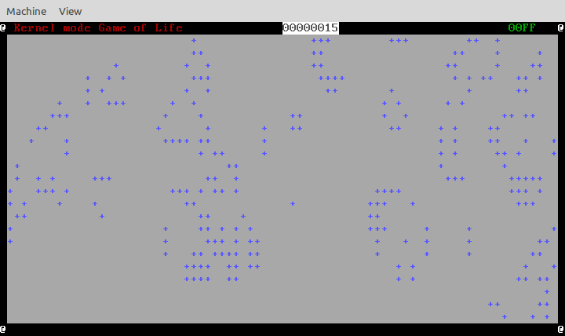

# Kernel Mode "Game of Life"



This is an attempt to implement [Conway's Game of Life][1] as a simple protected mode i386 kernel. The primary purpose for this is as a learning exercise. 

Based on the excellent intro by [Arjun Sreedharan][2] in the article [Kernel 101 – Let’s write a Kernel][3]

## Trying it out

The makefile expects to be run from a linux system with the dependencies outlined in the Kernel 101 article. 

* Linux 
* NASM assembler
* gcc
* ld (GNU Linker)
* qemu

The kernel must be complied on a linux machine, or with the GNU build tools targeting i386 elf binaries. The kernel once build can be run from any system supporting qemu in i386 mode. 

```bash
make
make run
```

This expects that qemu is installed an in the path. The ```qemu-system-i386``` executable is used. 

### Controls

    r       Returns the viewport to the original view 
    w       Move the viewport up
    s       Move the viewport down
    a       Move the viewport left
    d       Move the viewport right
    n       Advance the game 1 time step


## Builing on a mac

> Don't :)

A [Vagrantfile][4] is included that will watch for changes in the src folder and auto-rebuild the source. Allowing development from a mac without needing to install a cross-compiler for creating elf binaries. If there is a better way please submit a pull request. 

```bash
vagrant up
vagrant ssh -c "cd /vagrant && make watch" #do this from another terminal
```

## Licence 

MIT

## Resources

* http://duartes.org/gustavo/blog/post/kernel-boot-process/
* http://wiki.osdev.org/Text_Mode_Cursor
* http://www.acm.uiuc.edu/sigops/roll_your_own/
* http://www.cs.bham.ac.uk/~exr/lectures/opsys/10_11/lectures/os-dev.pdf
* http://www.computer-engineering.org/ps2keyboard/
* http://www.computer-engineering.org/ps2keyboard/scancodes1.html


[1]: http://en.wikipedia.org/wiki/Conway%27s_Game_of_Life "Conway's Game Of Life"
[2]: http://arjunsreedharan.org/
[3]: http://arjunsreedharan.org/post/82710718100/kernel-101-lets-write-a-kernel
[4]: http://www.vagrantup.com/

